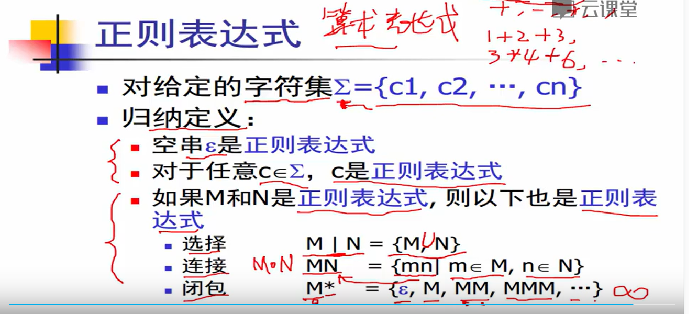

# 编译原理笔记
- [编译原理_中科大(华保健)](https://www.bilibili.com/video/BV16h411X7JY?p=1&vd_source=fcb5a5bbba15e874747108473094add4)

## 词法分析

字符流-->词法分析器-->记号流
手工构造：转移图算法（关键字哈希表算法，o(1)）
自动生成：正则表达式

参考文章：
https://juejin.cn/post/7203285698073116727
https://www.tr0y.wang/2021/04/01/%E7%BC%96%E8%AF%91%E5%8E%9F%E7%90%86%EF%BC%88%E4%B8%80%EF%BC%89%EF%BC%9A%E8%AF%8D%E6%B3%95%E5%88%86%E6%9E%90/

### 正则表达式

基本规则，归纳规则

正则表达式-->flex-->有限状态自动机

给定一个字符串，从起始状态，经过转移函数，最终都可以走到终结状态-->“接受”

- 确定有限状态自动机（DFA）：最多只有一个状态可以转移
- 非确定有限状态自动机（NFA）

RE-->NFA-->DFA-->词法分析器的代码表示

### Tompson算法：RE-->NFA

### 子集构造算法：NFA-->DFA

 - 不动点算法，O(2^N)
 - 步骤：
   - delta(q)：基于q(n-1)节点中所有n节点，求q(n)
   - 再求e-闭包：扩展求所有e连接的点。深度/广度算法都行，如下：
 

DFA最小化算法：Hopcroft算法、

- 先根据非终结状态，终结状态节点划分成两个等价类
- 对每个等价类中的每个节点，查看是否有转移外面的，可以继续切分

### 词法分析器的代码表示：DFA的生成算法

- 转移表

最长匹配，需要stack

可以匹配ifif和ifii->if

 - 跳转表

 