# 编译原理笔记
- [编译原理_中科大(华保健)](https://www.bilibili.com/video/BV16h411X7JY?p=1&vd_source=fcb5a5bbba15e874747108473094add4)

## Lexical Analysis 词法分析

```
字符流-->词法分析器-->记号流
```
 - 手工构造：转移图算法（关键字和标识符重叠的情况：关键字哈希表算法，o(1)，详见参考文章1）
 - 自动生成：声明式规范（正则则表达式） => 某工具 => 词法分析器

参考文章：
 - https://juejin.cn/post/7203285698073116727
 - https://www.tr0y.wang/2021/04/01/%E7%BC%96%E8%AF%91%E5%8E%9F%E7%90%86%EF%BC%88%E4%B8%80%EF%BC%89%EF%BC%9A%E8%AF%8D%E6%B3%95%E5%88%86%E6%9E%90/

### 正则表达式

```
对于给定的字符集：Σ = {c1, c2, ..., cn}，有
1. ε（空字符串）是正则表达式
2. 对于任意 c ∈ Σ，c 是正则表达式
3. 如果 M、N 是正则表达式，那么以下都是正则表达式
   - 选择：M | N == {M, N}
   - 连接：MN == {mn | m ∈ M, n ∈ N}
   - 闭包：M* == {ε, M, MM, MMM, ...}
```

基本规则，归纳规则

正则表达式-->某工具：flex-->有限状态自动机

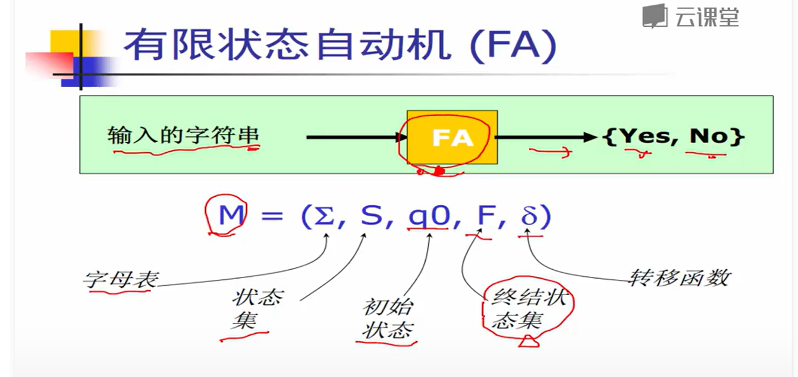
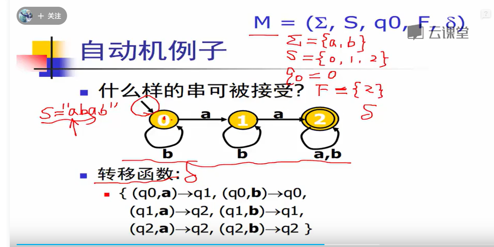

给定一个字符串，从起始状态，经过转移函数，最终都可以走到终结状态-->“接受”

- 确定有限状态自动机（DFA）：对于每个字符，最多只有一个状态可以转移
- 非确定有限状态自动机（NFA）：对于每个字符，有多于一个状态可以转移。DFA 与 NFA 主要的区别就在于判断 “接受” 的难度不同。NFA 不能直接回答 “no”，而是需要回滚路线，重新尝试，直到所有可能路线都无法接受，才能回答 “no”。


RE-->NFA-->DFA-->词法分析器的代码表示

#### 1.RE-->NFA：Tompson算法

- 对于基本的 re（上一节1,2情况），直接构造
- 对于复合的 re（上一节3情况），递归构造

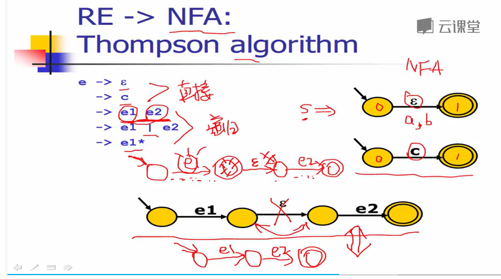
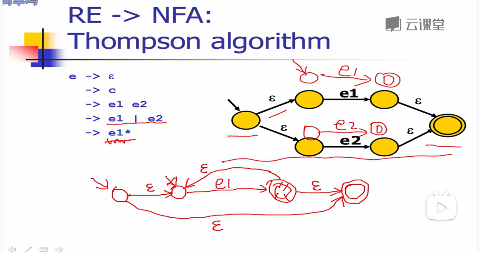


#### 2.NFA-->DFA：子集构造算法

伪代码和示例如下:

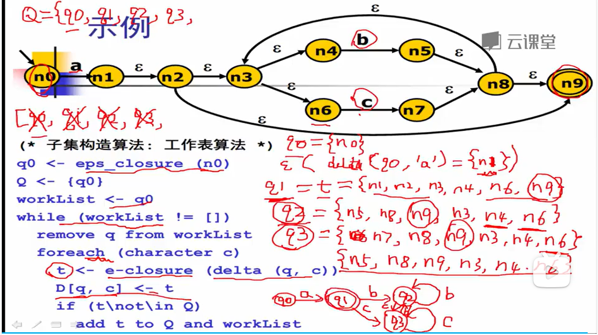
 
 - 不动点算法原理，O(2^N)
 - 步骤：
   - delta(q)：基于q(n-1)节点中所有状态集，遍历每一个字符（不能是ε），求q(n)
   - 再求e-闭包：扩展求所有ε连接的点。深度/广度算法都行，如下：
 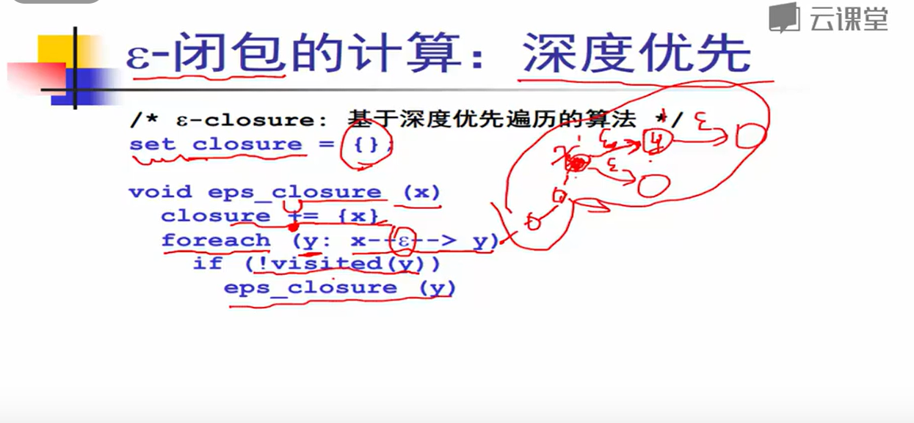

 算法一定会运行结束吗？因为其实最多只会生成 2^n 个状态集，n 是状态转移图里的状态数量，所以这个算法q生成是单调递增的，如果收集所有状态集就会停止了，并且这是最糟糕的情况，实际情况中，不太可能有所有状态的组合。例如我们上面那个例子，状态转移图里的状态数量一共是 10 个，理论上会生成 2^10 = 1024 个不同的 q，肯定没有这么多。

#### 3.DFA最小化算法：Hopcroft算法

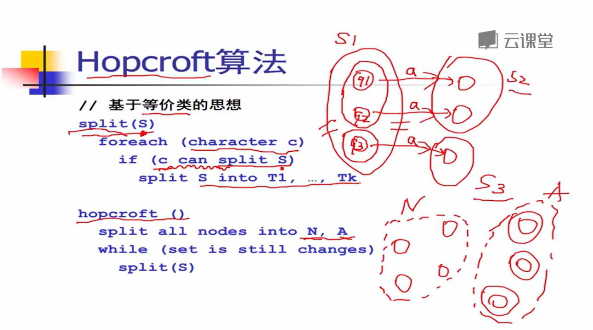

- 先根据非终结状态，终结状态节点划分成两个等价类
- 对遍历等价类中的每个节点，查看该节点是否有转移到外面的相同等级类可以合并；不同等价类，可以继续切分

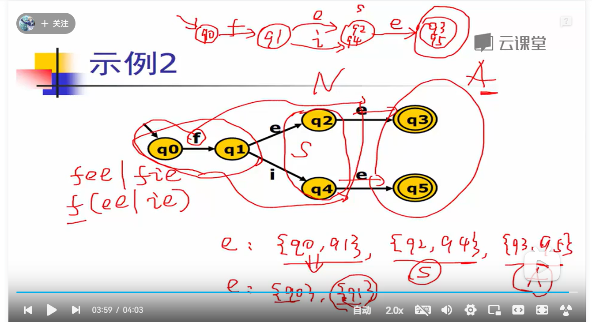

#### 4.词法分析器的代码表示：DFA的生成算法

 - 转移表

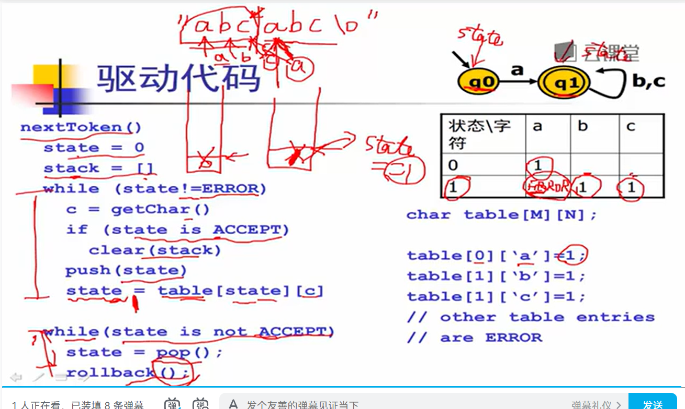

最长匹配，需要stack

可以匹配ifif和ifii->if
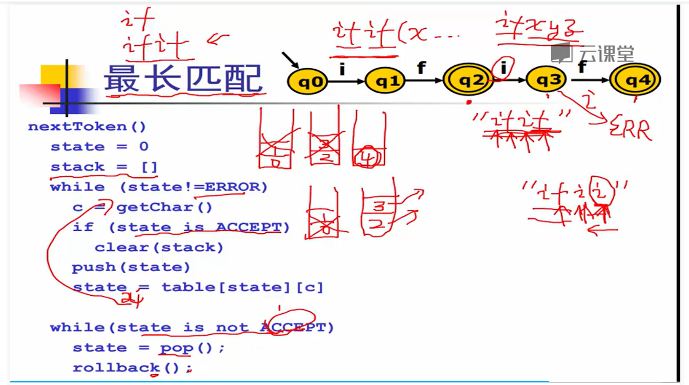

 - 跳转表

 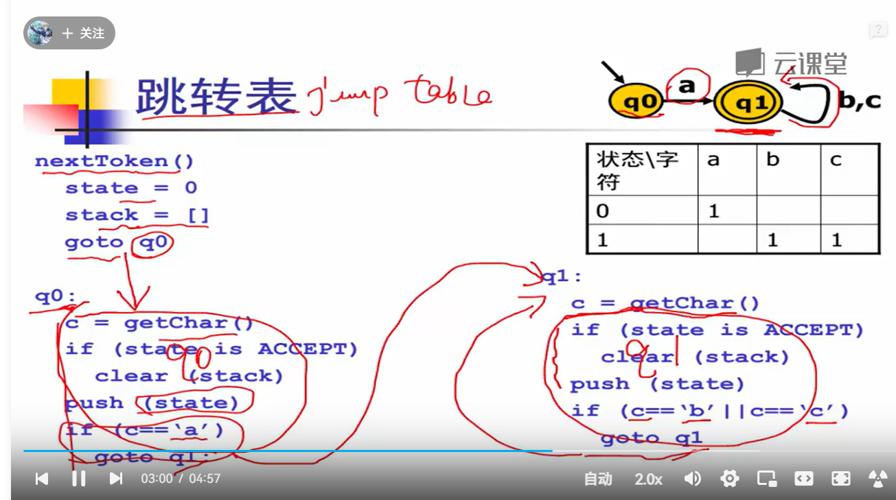


## Lexical Analysis 语法分析

引用：

- https://www.tr0y.wang/2021/04/02/%E7%BC%96%E8%AF%91%E5%8E%9F%E7%90%86%EF%BC%88%E4%BA%8C%EF%BC%89%EF%BC%9A%E8%AF%AD%E6%B3%95%E5%88%86%E6%9E%90%E4%B9%8B%E8%87%AA%E9%A1%B6%E5%90%91%E4%B8%8B%E5%88%86%E6%9E%90%E7%AE%97%E6%B3%95/

```
记号流(token sequence) -->语法分析器(parser) -->语法树( abstract syntax tree)
                              ↑
                          语言的规则(language syntex)
```
乔姆斯基文法体系给出了 4 类文法：

- 0型文法：任意文法，在程序设计语言当中不常用
- 1型文法：上下文有关文法，在程序设计语言当中也不常用
- 2型文法：即 CFG，这种文法可以用来描述语言的语法结构。
- 3型文法：又叫做正则文法，其实词法分析器已经讨论过了，即正则表达式，这种文法可以用来描述语言的词法结构。

在这些文法中，0型文法的表达能力最强，3型文法最弱

### 上下文无关文法（CFG）

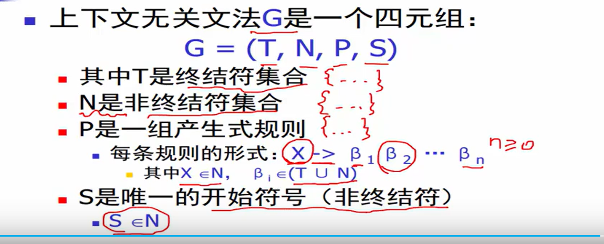

### CFG 的推导

推导的定义：给定文法 G，从 G 的开始符号 S 开始，用产生式的右部替换左侧的非终结符，不断重复，直到不出现非终结符为止。最后的得到的结果，我们把它称为**句子**。

推导的方式，根据替换的顺序，分为 2 种：
- 最左推导: 每次总是选择最左侧的符号进行替换
- 最右推导: 每次总是选择最右侧的符号进行替换

由此我们可以得出语法分分析的具体含义：给定文法 G 和句子 s，回答是否存在对句子 s 的推导

语法分析器的输入是记号流，其实就是句子 s；而判断句子是否符合语法规则，就可以利用文法 G 来做判断。

### 分析树
推导过程，实际上可以表达成**树状结构**

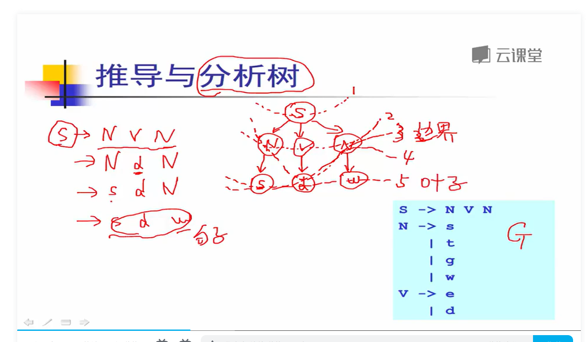

每个内部节点代表的是非终结符；叶子节点代表终结符；每一步推导代表如何从双亲节点生成它的直接孩子节点。如上图的1,2,3,4,5步

### 推导的二义性

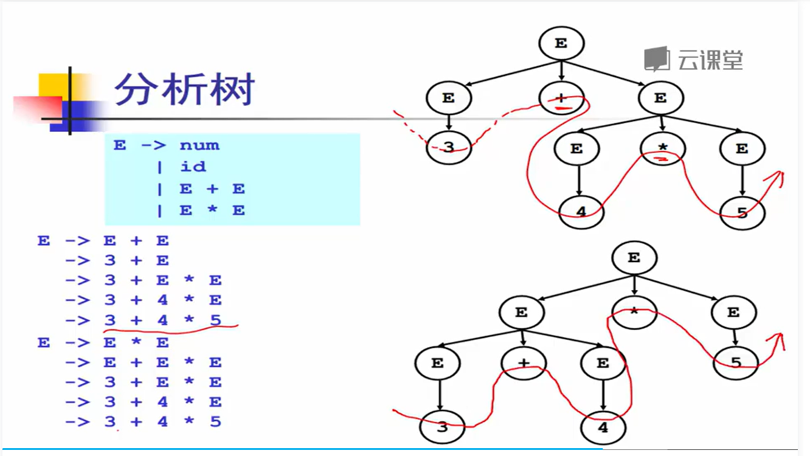

通过对比可以看出，分析树的含义取决于对树进行后序遍历的结果。
 - 对于第一种方式来说，应该是 3 + (4 * 5) = 23；
 - 对于第二种方式来说，是 (3 + 4) * 5 = 35。
按照我们的常识来说，肯定是第一种才是我们想要的结果。

所以这个文法就是 二义性文法：给定文法 G，如果存在句子 s，它有两棵不同的分析树（同样是最左推导），那么称 G 是二义性文法。

#### 消除左递归

重写文法就可以解决二义性。对于上面这个例子来说，我们想要先计算 *，则可以将推导过程分解为先计算 T = F * F，然后在计算 E = T + T。

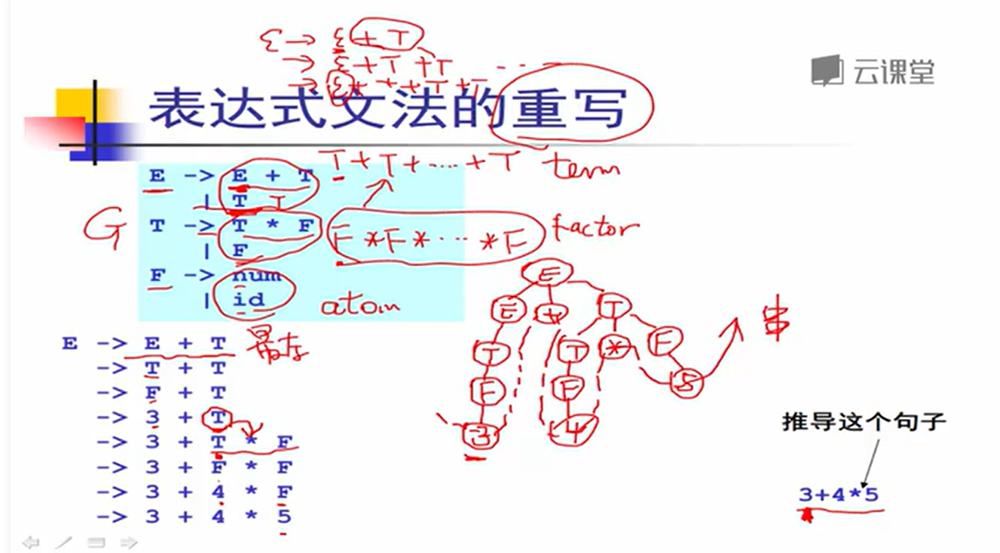

#### 自顶向下分析算法实现
上面说的分析方式，都是从开始符号出发推出句子，因此称为自顶向下分析，对应于分析树就是自顶向下的构造顺序。（BFS思路）

自顶向下分析算法的定义：

目标：给定文法 G 和句子 s，回答 s 是否能够从 G 推导出来?

基本算法思想：从 G 的开始符号出发，随意推导出某个句子 t，比较 t 和 s
若 t == s，则回答 “是”；若 t != s，则回溯。

需要注意的是，如果 t != s，我们是不能直接回答 “否” 的，因为 t 有很多种可能性，所以只有当 G 可以推导出的所有句子 t 都不等于 s 的时候，我们才能回答 “否”。

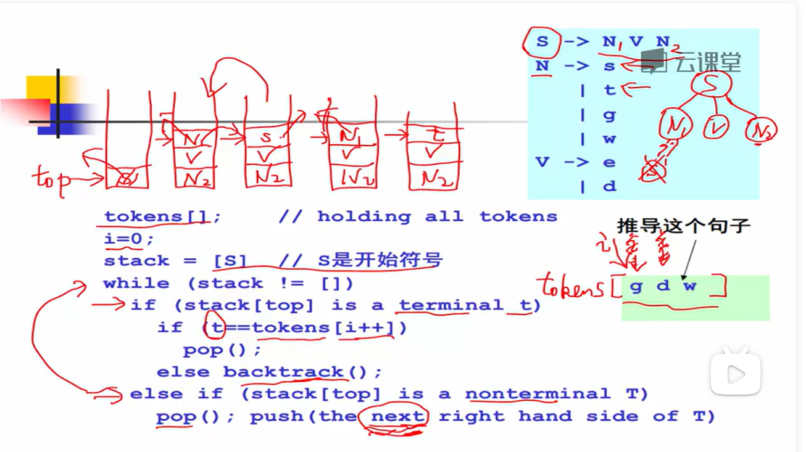

- 需要向前尝试，向后回溯。分析效率昂贵
- 需要线性时间的算法：避免回溯。引入：
  - 递归下降分析算法：手动
  - LL(K)算法：自动
  - LR(K)算法：自动


### 递归下降分析算法(prediction/ top-down parsing)

递归下降分析算法 也称为预测分析。

- 它分析高效（线性时间），
- 容易实现（方便手工编码），
- 错误定位和诊断信息准确，被很多开源和商业的编译器所采用，比如 GCC4.0, LLVM, ...。

算法基本思想：（**分治法**）
- 每个非终结符都要实现一个相应的parse分析函数
- 在parse函数中用**前看符号（token）**指导产生式规则的选择，避免回溯。- parse函数的实现：遇到产生式规则中的非终结符递归调用，遇到比较终结符比较，比较不到报错
- 条件：每个右部都应该不相交的

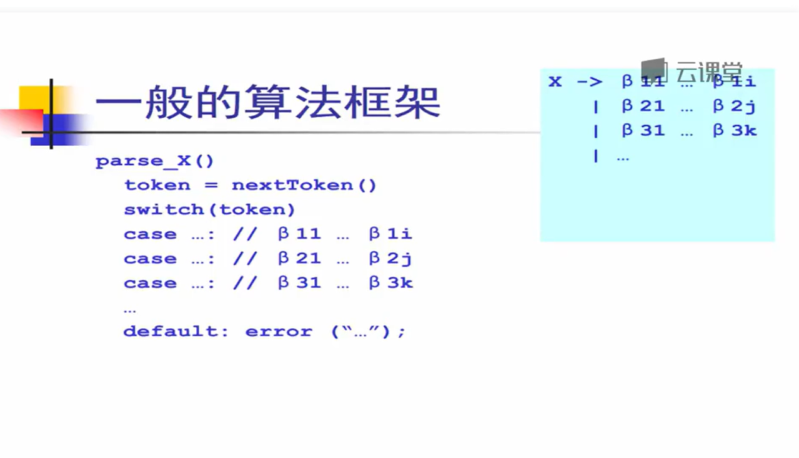

#### 消除完左递归的递归下降分析
两者产生式规则写法：
```
E -> E + T
   | T
T -> T * F
   | F
F -> num
   | id
```
<===>
```
E -> T (+ T)*
T -> F (* F)*
F -> num
```

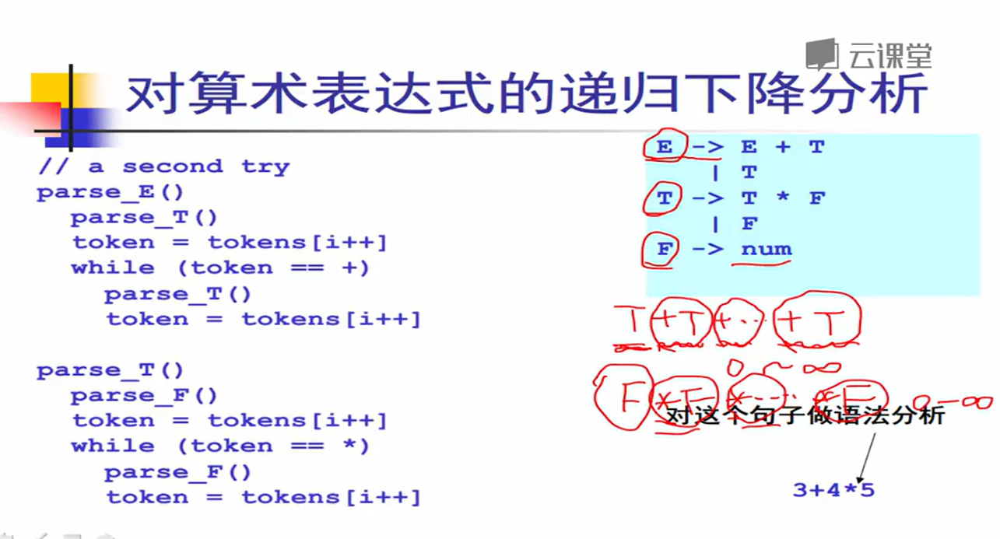

### LL(K)