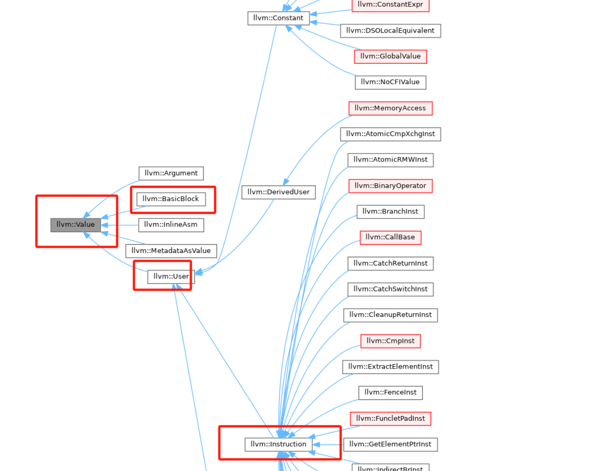
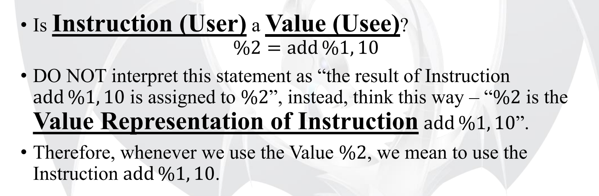
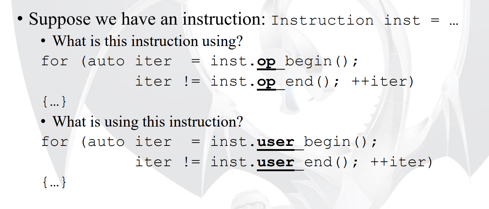

# value user use in llvm


llvm源码中通过`value`、`user`、`use`这些基础类来表示llvm ir和他们之间的def-use关系（或者说user-usee）。

## 预备知识点

- 什么是llvm ir？：首先需要了解llvm ir的基础概念和设计，可以直接看[官方介绍llvm ir的视频](https://www.youtube.com/watch?v=m8G_S5LwlTo&t=249s&ab_channel=LLVM)，我也写了一篇[笔记](https://zhuanlan.zhihu.com/p/685467026)

 - 为什么llvm ir需要ssa？：llvm ir中除了alloca/store/load都是SSA形式的，在创建SSA形式的llvm ir时，SSA value之间的def-use信息也会一同被建立。具体解析可以看下面文章：
   - [对于LLVM之类的编译器是如何实现在构造 SSA 形式的 IR 的时候，计算出 def-use 链？](https://www.zhihu.com/question/41999500/answer/93243408)
   - [SSA的优势](https://blog.csdn.net/dashuniuniu/article/details/52189814)

## 站在前人的基础上

下面是已有的优秀文章:
 - [深入浅出 LLVM之 Value 、User 、Use 源码解析](https://zhuanlan.zhihu.com/p/666016704)
 - [LLVM笔记(16) - IR基础详解(一) underlying class](https://www.cnblogs.com/Five100Miles/p/14083814.html)

本文是对上述文章的总结和补充，用来加深理解，如有不对之处请指出。前人说过的部分我这里就不。

源码llvm17.0.6

## 概要

- 

## 一切皆value

我们看下`llvm::value`的定义：

```c++
/// LLVM Value Representation
///
/// This is a very important LLVM class. It is the base class of all values
/// computed by a program that may be used as operands to other values. Value is
/// the super class of other important classes such as Instruction and Function.
/// All Values have a Type. Type is not a subclass of Value. Some values can
/// have a name and they belong to some Module.  Setting the name on the Value
/// automatically updates the module's symbol table.
///
/// Every value has a "use list" that keeps track of which other Values are
/// using this Value.  A Value can also have an arbitrary number of ValueHandle
/// objects that watch it and listen to RAUW and Destroy events.  See
/// llvm/IR/ValueHandle.h for details.
class Value {
  Type *VTy;
  Use *UseList;
  const unsigned char SubclassID;   // Subclass identifier (for isa/dyn_cast)
  unsigned char HasValueHandle : 1; // Has a ValueHandle pointing to this?
  unsigned short SubclassData;
  ...
}
```
通过value的注释，我们基本可以了解到：
 - `value`是llvm中的基类。比如用到最多的`Instruction`、还有`Function`、`BasicBllock`等等都是value，[下图](https://llvm.org/doxygen/classllvm_1_1Value.html)展示了`value`的继承类。
 - 任何`Value`都有一个类型。并且有名字的`value`会自动注册到`module`的符号表中
 - 通过添加一个`Use`类的`UseList`指针，用于跟踪使用过该`Value`的其他值。后面会详细介绍`Use`类的用法
 - 另外一个重要的成员是SubclassID, 这是一个const值, 用来指示这个Value的子类型. 其用于isa<>与dyn_cast<>的判断.详细可以看网上关于llvm的RTTI介绍，比如这篇。

 

 下面就是重点介绍User、Use类，大家通过上述的一些文章已经了解整体设计，或者有些懵懵懂懂的。

别着急，我下面梳理下具体细节和总结点

 ## 初识User、Use类

首先我们要理解llvm使用User、Use类的目的就是在生成Instruction的时候就建立好指令之间的User-Usee关系（还有BB间的关系）。有些编译器会先创建好ir后再通过遍历实现上述目的。这也是llvm设计的精巧之处，不然没有这么复杂o(*￣︶￣*)o

带着这个目的，我们可以思考下：
 - 一条Instruction的User和Usee是什么？如下图1
 - llvm如何生成一条指令的，并且建立好User-Usee关系？
 - 如何通过User找到所有Usee，或反向通过Usee找到所有的Users？双向的，如下图2

图1：
 

图2：
 

### 一条Instruction的内存布局

[深入浅出 LLVM之 Value 、User 、Use 源码解析](https://zhuanlan.zhihu.com/p/666016704)这篇文章的大佬在其中一章中对一条Instruction的创建和内存布局描述的很详细了，我这里就不再细说了。总结下：

 - Instruction的继承关系：`Instruciotn <-- User <-- Value`。这其中User类的作用就是主导User(Value)和Uses的内存布局，也可以说建立好User(Value)->Usee链关系。
 - 一个Instruction创建一个User和几个Use（operation）是固定的一块内存。是通过`operation new`和`placement new`自定义new的方式分配内存并初始化（之前介绍的llvm读文件的MemoryBuffer也是通过这种方式）
 - 这样设计的好处是User在寻找Usee时可以直接通过计算Use*偏移就可以得到第几个操作数了。不用维护链表所以我们看到User里面很干净，连Use的指针都不需要保存，也节省了空间。

其中，有两种布局方式（这里的P就是Use）：
 - a)固定数量的Use：`User::allocateFixedOperandUser`方法
 - b)大数量的Use：`User::allocHungoffUses`方法

```
Layout a) is modelled by prepending the User object by the Use[] array.
...---.---.---.---.-------...
  | P | P | P | P | User
'''---'---'---'---'-------'''
```

```
Layout b) is modelled by pointing at the Use[] array.

.-------.------...
| Use** |  User
'-------'------'''
    |
    v
    .---.---.---.---...
    | P | P | P | P |
    '---'---'---'---'''

```
https://www.llvm.org/docs/ProgrammersManual.html#the-core-llvm-class-hierarchy-reference

### User-->Use

如下是`User`的定义和部分重要函数

 ```C++
 class User : public Value {

  LLVM_ATTRIBUTE_ALWAYS_INLINE static void *
  allocateFixedOperandUser(size_t, unsigned, unsigned);

protected:
  /// Allocate a User with an operand pointer co-allocated.
  ///
  /// This is used for subclasses which need to allocate a variable number
  /// of operands, ie, 'hung off uses'.
  void *operator new(size_t Size);

  /// Allocate a User with the operands co-allocated.
  ///
  /// This is used for subclasses which have a fixed number of operands.
  void *operator new(size_t Size, unsigned Us);

  /// Allocate a User with the operands co-allocated.  If DescBytes is non-zero
  /// then allocate an additional DescBytes bytes before the operands. These
  /// bytes can be accessed by calling getDescriptor.
  ///
  /// DescBytes needs to be divisible by sizeof(void *).  The allocated
  /// descriptor, if any, is aligned to sizeof(void *) bytes.
  ///
  /// This is used for subclasses which have a fixed number of operands.
  void *operator new(size_t Size, unsigned Us, unsigned DescBytes);

  template <int Idx> Use &Op() {
    return OpFrom<Idx>(this);
  }
  template <int Idx> const Use &Op() const {
    return OpFrom<Idx>(this);
  }

private:
  const Use *getHungOffOperands() const {
    return *(reinterpret_cast<const Use *const *>(this) - 1);
  }

  Use *&getHungOffOperands() { return *(reinterpret_cast<Use **>(this) - 1); }

  const Use *getIntrusiveOperands() const {
    return reinterpret_cast<const Use *>(this) - NumUserOperands;
  }

public:
  const Use *getOperandList() const {
    return HasHungOffUses ? getHungOffOperands() : getIntrusiveOperands();
  }

  Value *getOperand(unsigned i) const {
    assert(i < NumUserOperands && "getOperand() out of range!");
    return getOperandList()[i];
  }
  Use &getOperandUse(unsigned i) {
    assert(i < NumUserOperands && "getOperandUse() out of range!");
    return getOperandList()[i];
  }

  unsigned getNumOperands() const { return NumUserOperands; }


  // Methods for support type inquiry through isa, cast, and dyn_cast:
  static bool classof(const Value *V) {
    return isa<Instruction>(V) || isa<Constant>(V);
  }
};
 ```

 如何通过User找到Usee？

原理就很简单了。由于uses的内存是固定分配好的，通过Use的首地址后计算index的偏移量，如下函数实现：

 - `getOperand`函数
 - `Op<>()`函数（通过模块偏特化实现的，可以静态检查index数量）

这里补充下`Op<-1>()`的实现(负索引代表从后往前)，是通过模板偏特化实现，好处是可以静态检查index范围是否合法。但是由于proctect需要每个子类都要实现偏特化。如下代码：

```c++
  template <int Idx> Use &Op() {
    return OpFrom<Idx>(this);
  }

template <int Idx, typename U> static Use &OpFrom(const U *that) {
    return Idx < 0
      ? OperandTraits<U>::op_end(const_cast<U*>(that))[Idx]
      : OperandTraits<U>::op_begin(const_cast<U*>(that))[Idx];
  }

template <class>
struct OperandTraits;

template <>
struct OperandTraits<BinaryOperator> :
  public FixedNumOperandTraits<BinaryOperator, 2> {
};

template <typename SubClass, unsigned ARITY>
struct FixedNumOperandTraits {
  static Use *op_begin(SubClass* U) {
    static_assert(
        !std::is_polymorphic<SubClass>::value,
        "adding virtual methods to subclasses of User breaks use lists");
    return reinterpret_cast<Use*>(U) - ARITY;
  }
  static Use *op_end(SubClass* U) {
    return reinterpret_cast<Use*>(U);
  }
  static unsigned operands(const User*) {
    return ARITY;
  }
};
```

 ## Use类的作用

我们首先看下Use类的定义：

```c++
/// A Use represents the edge between a Value definition and its users.
///
/// This is notionally a two-dimensional linked list. It supports traversing
/// all of the uses for a particular value definition. It also supports jumping
/// directly to the used value when we arrive from the User's operands, and
/// jumping directly to the User when we arrive from the Value's uses.
class Use {
...
private:
  Value *Val = nullptr;
  Use *Next = nullptr;
  Use **Prev = nullptr;
  User *Parent = nullptr;

  void addToList(Use **List) {
    Next = *List;
    if (Next)
      Next->Prev = &Next;
    Prev = List;
    *Prev = this;
  }

  void removeFromList() {
    *Prev = Next;
    if (Next)
      Next->Prev = Prev;
  }
};
```
  - 我这里把Use理解成槽的概念，一个User（Instruction）创建出的几个Use（operation）是固定的一块内存，里面具体填什么value可以随时替换

 ## 引用

 - http://www.cs.toronto.edu/~pekhimenko/courses/cscd70-w18/docs/Tutorial%202%20-%20Intro%20to%20LLVM%20(Cont).pdf