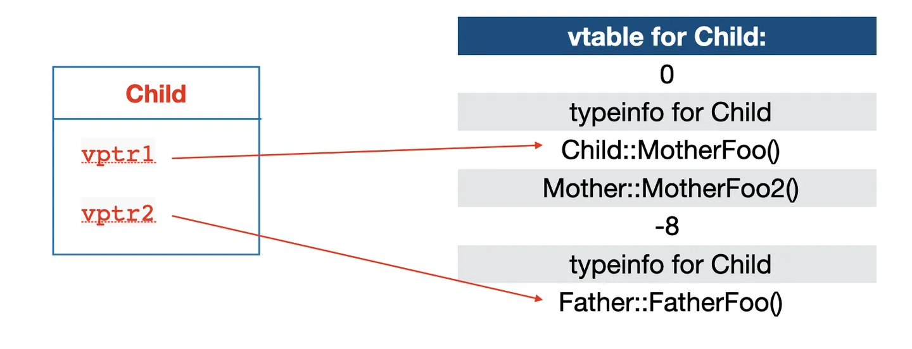

#! https://zhuanlan.zhihu.com/p/687308019
# c++ vtable in llvm ir


- 本文是对[c++ vtable 深入解析](https://zhuanlan.zhihu.com/p/268324735)的学习，作者深入解析vtable在x86汇编上的实现。

- 本文是从`llvm ir`的角度进行补充。因为本质上来说，vtable是编译器来生成的，所以从llvm ir上理解vtable的实现更具体一点

- vtable的基础知识可以看这篇：[C++中虚函数、虚继承内存模型](https://zhuanlan.zhihu.com/p/41309205)，写得很详细

- [What is the VTT for a class?](https://stackoverflow.com/questions/6258559/what-is-the-vtt-for-a-class)

- llvm ir相关的基础知识可以参考我写的另一篇文章：[llvm ir笔记](https://laity000-learning-notes.readthedocs.io/en/latest/llvm/llvm_ir.html)


## 概要

你可以了解到：
 - vtable与vptr的含义和在llvm ir中的实现
 - 多重继承时vtable与vptr的初始化和虚函数调用的细节
 - thunk的作用

概要：

1.对于每一个多态类型（有虚函数的类），其所有的虚函数的地址都以一个表格的方式存放在一起，称之为`vtable`。在llvm ir上是`指针数组类型的全局变量`，在汇编上是放在`数据段`。

2.每个虚函数的偏移量在基类和子类中均相同，所以虚函数相对于vtable首地址的偏移量在编译时就确定。

3.编译器会给多态对象多创建一个指针`成员变量`（在对象首地址），称为虚(表)指针(vptr)或者虚函数指针(vfptr)。并且编译器会偷偷在对应的构造函数里加上vptr初始化的逻辑：
 - 将vtable地址赋值到vptr（实际上是拿到了vtable里第一个虚函数的地址指针，用gep指令加上偏移，因为前面还有`offset_to_top` `typeinfo`成员，这样我们调用的时候就不需要额外处理）
 - 构造函数里可以拿到对象的this指针，new的时候哪个被调决定了多态的实际类型和vtable，所以说构造函数不能是虚函数
 - 多重继承的子类由于有多个vptr需要赋值多次，通过`offset_to_top`区分vptr位置

4.vtable成员有哪些：
 - `offset_to_top`：简单理解就是各个vptr从this指针开始的偏移量。（后面会着重介绍）
   - 单继承：基类和子类的虚指针共用一个this地址,不用加偏移，offset_to_top是0
   - 多重继承：子类会有多个虚指针，主基类共用一个地址，不用加偏移；非主基类时要加偏移（偏移为前个基类的sizeof）
 - `typeinfo`
 - 虚函数地址：相同虚函数在各个vtable上偏移量是固定的
 - 虚继承时还会添加其他成员

5.通过引用或指针调用虚函数时，首先通过虚指针和偏移量计算出虚函数的地址，然后进行调用。多重继承的非主基类指针调用子类虚函数通过`this指针+offset_to_top`和`Thunk方式`实现调用

6.类的虚表会被这个类的所有对象所共享。但是类的每一个对象有一个属于它自己的虚表指针。

下面从vtable、vptr、虚函数调用深入分析在`llvm ir`中是如何的实现：

## 例子

```c++
class Mother {
public:
 virtual void MotherFoo() { printf("Mother - %p\n", this); }
 void simple() { printf("Simple - %p\n", this); }
 virtual void MotherFoo2() { printf("Mother222 - %p\n", this); }
};

class Father {
public:
 virtual void FatherFoo() {}
};

class Child : public Mother, public Father {
public:
 void MotherFoo() override { printf("Child - %p\n", this); }
};

int main() {
    Mother *b = new Mother();
    b->MotherFoo();
    b->simple();
    Child *c = new Child();
    c->MotherFoo();
    c->MotherFoo2();
    delete b;
    delete c;

    return 0;
}
```


可以看到上面是一个多重继承的例子，`Child`有两个基类，`Mother`和`Father`。

llvm ir在这里可以看到: https://godbolt.org/z/3jz34Y8a6

这里用的llvm17.0.0编译的，[指针是不透明的](https://llvm.org/docs/OpaquePointers.html)

单继承的例子这里不再介绍了。通过`多重继承`都可以了解。

## 多重继承的vtable in llvm ir格式

```c++
@vtable for Mother = linkonce_odr dso_local unnamed_addr constant { [4 x ptr] } { [4 x ptr] [ 
  ptr null, 
  ptr @typeinfo for Mother, 
  ptr @Mother::MotherFoo(), 
  ptr @Mother::MotherFoo2()] }, comdat, align 8

@vtable for Father = linkonce_odr dso_local unnamed_addr constant { [3 x ptr] } { [3 x ptr] [
  ptr null, 
  ptr @typeinfo for Father, 
  ptr @Father::FatherFoo()] }, comdat, align 8

@vtable for Child = linkonce_odr dso_local unnamed_addr constant { [5 x ptr], [3 x ptr] } { 
  [5 x ptr] [
    ptr null,
    ptr @typeinfo for Child, 
    ptr @Mother::MotherFoo(), 
    ptr @Mother::MotherFoo2(), 
    ptr @Child::FatherFoo()], 
  [3 x ptr] [
    ptr inttoptr (i64 -24 to ptr), 
    ptr @typeinfo for Child, 
    ptr @non-virtual thunk to Child::FatherFoo()] }, comdat, align 8


@typeinfo for Mother = linkonce_odr dso_local constant { ptr, ptr } { 
  ptr getelementptr inbounds (ptr, ptr @vtable for __cxxabiv1::__class_type_info, i64 2), 
  ptr @typeinfo name for Mother }, comdat, align 8
@typeinfo for Father = linkonce_odr dso_local constant { ptr, ptr } { 
  ptr getelementptr inbounds (ptr, ptr @vtable for __cxxabiv1::__class_type_info, i64 2), 
  ptr @typeinfo name for Father }, comdat, align 8
@typeinfo for Child = linkonce_odr dso_local constant { ptr, ptr, i32, i32, ptr, i64, ptr, i64 } { 
  ptr getelementptr inbounds (ptr, ptr @vtable for __cxxabiv1::__vmi_class_type_info, i64 2), 
  ptr @typeinfo name for Child, 
  i32 0, 
  i32 2, 
  ptr @typeinfo for Mother, 
  i64 2, 
  ptr @typeinfo for Father, 
  i64 6146 }, comdat, align 8

@vtable for __cxxabiv1::__class_type_info = external global ptr
@typeinfo name for Mother = linkonce_odr dso_local constant [8 x i8] c"6Mother\00", comdat, align 1
@vtable for __cxxabiv1::__vmi_class_type_info = external global ptr
@typeinfo name for Child = linkonce_odr dso_local constant [7 x i8] c"5Child\00", comdat, align 1
@typeinfo name for Father = linkonce_odr dso_local constant [8 x i8] c"6Father\00", comdat, align 1

```

我们首先看下例子中vtable的结构：
 - vtable是一个指针类型的数组，当有多重继承，子类是多维数组，比如`Child`是`[5 x ptr], [3 x ptr]`。里面的内容编译器已经帮我们填好了。
 - 第一个成员是`offset_to_top`
 - 第二个成员是`typeinfo`
 - 后面依次是函数地址，相同虚函数的偏移是固定的。这样当**通过基类指针或引用调用虚函数时**不管哪个实际类型，编译器无脑加偏移就好了。

 我们着重看下新出现的两个成员：

### `offset_to_top`

`offset_to_top`简单来说，这里记录的是vptr从this指针开始的偏移量。

怎么理解呢？

如果是单继承，基类和父类可以共用一个this指针，或者说是vptr。因为相同虚函数的偏移在vtable上是固定的，运行时在根据实际类型走哪个vtable，所以`offset_to_top`是0

但是多重继承时，一个vptr就无法满足了。比如`@Mother::MotherFoo`和`@Father::FatherFoo()`偏移都是0。那么就要决定从哪个基址开始才能区别？

所以多重继承的子类设置多个vptr来区分基址。
 - 主基类共用一个地址，这里是`Mother*`，所以第一个vptr的`offset_to_top`是0；
 - 非主基类时要加偏移（偏移为内存模型里前个基类的sizeof），这里是`Father*`，所以第二个vptr的`offset_to_top`是-24

为什么是-24的偏移? 这里跟`Mother`的内存布局有关，后面在介绍vptr时会详细说下

### typeinfo

首先是 type_info 方法的辅助类，是 __cxxabiv1 里的某个类。 对于启用了 RTTI 的类来说，
 - 所有的基础类（没有父类的类）都继承于_class_type_info,
 - 所有的基础类指针都继承自__pointer_type_info，
 - 所有的单一继承类都继承自__si_class_type_info，
 - 所有的多继承类都继承自__vmi_class_type_info。

然后是指向存储类型名字的指针，如果有继承关系，则最后是指向父类的 typeinfo 的记录。

### 多重继承的虚函数指针

**这里有个奇怪的地方**：`ptr @Child::FatherFoo()`和`ptr @non-virtual thunk to Child::FatherFoo()`

我们知道`Child*`指针和`Father*`指针都可以调用`@Child::FatherFoo()`，反正偏移都是一样的，为什么不是直接在把`ptr @Child::FatherFoo()`覆盖到`ptr @non-virtual thunk to Child::FatherFoo()`的位置？

这就涉及到前面说的：虽然在ir层面确实表示的是`FatherFoo()`函数的地址，但是，别忘了，如果实际对象是`Child*`，在调用`FatherFoo()`时首先this指针被加了`offset_to_top`=24的偏移得到vptr，后面还需要把this指针的偏移恢复后传入，不然后面调用`FatherFoo()`对this指针的操作就不对了，比如访问Child的成员变量，——这就是thunk的操作。我们在后面**基类指针调用子类虚方法**章节再详细看下llvm ir的流程。

这个问题在子类vtable的主基类上是不需要的，因为`Child`指针和`Mother`共用一个this指针

对了，如果我们没有在子类重写了`FatherFoo`函数也就不会出现`Thunk`了，如下：
```c++
@vtable for Child = linkonce_odr dso_local unnamed_addr constant { [4 x ptr], [3 x ptr] } {
...
[3 x ptr] [
  ptr inttoptr (i64 -24 to ptr), 
  ptr @typeinfo for Child, 
  ptr @Father::FatherFoo()] }, comdat, align 8
```

最后，我们可以看下例子中vtable对应的x86汇编就很好理解了：

```c++
vtable for Mother:
        .quad   0
        .quad   typeinfo for Mother
        .quad   Mother::MotherFoo()
        .quad   Mother::MotherFoo2()

typeinfo name for Mother:
        .asciz  "6Mother"

typeinfo for Mother:
        .quad   vtable for __cxxabiv1::__class_type_info+16
        .quad   typeinfo name for Mother

.L.str:
        .asciz  "Mother - %p\n"

.L.str.1:
        .asciz  "Mother222 - %p\n"

.L.str.2:
        .asciz  "Simple - %p\n"

vtable for Child:
        .quad   0
        .quad   typeinfo for Child
        .quad   Mother::MotherFoo()
        .quad   Mother::MotherFoo2()
        .quad   Child::FatherFoo()
        .quad   -24
        .quad   typeinfo for Child
        .quad   non-virtual thunk to Child::FatherFoo()

typeinfo name for Child:
        .asciz  "5Child"

typeinfo name for Father:
        .asciz  "6Father"

typeinfo for Father:
        .quad   vtable for __cxxabiv1::__class_type_info+16
        .quad   typeinfo name for Father

typeinfo for Child:
        .quad   vtable for __cxxabiv1::__vmi_class_type_info+16
        .quad   typeinfo name for Child
        .long   0                               # 0x0
        .long   2                               # 0x2
        .quad   typeinfo for Mother
        .quad   2                               # 0x2
        .quad   typeinfo for Father
        .quad   6146                            # 0x1802

vtable for Father:
        .quad   0
        .quad   typeinfo for Father
        .quad   Father::FatherFoo()
```

## vptr的布局

```c++
%class.Mother = type <{ i32 (...)**, i32, i32, i32, [4 x i8] }>
%class.Father = type <{ i32 (...)**, i32, [4 x i8] }>
%class.Child = type { %class.Mother.base, [4 x i8], %class.Father.base, i32 }
%class.Mother.base = type <{ i32 (...)**, i32, i32, i32 }>
%class.Father.base = type <{ i32 (...)**, i32 }>
```

以上每个class的类型布局，编译器提前帮我们分配好了
 - 每个类的基址上存放的是vptr指针
 - 多重继承的子类有多个vptr，这里`%class.Child`有两个vptr，分别是`%class.Mother.base`和`%class.Father.base`首地址
 - 我们观察`%class.Mother.base`的类型定义，sizeof是8 + 3 * 4 = 20，再加上4字节补齐，最终是24。所以解释了上一节第二个vptr的`offset_to_top`是-24

## vptr的初始化

有了vtable和vptr的内存布局，我们vptr是如何将vtable关联起来的-->vptr是如何初始化的?
 - 赋值时机：构造函数里可以拿到对象的this指针，调用哪个决定了多态的实际类型，
 - 将vtable地址赋值到vptr，实际上是拿到了vtable里第一个虚函数的地址，用gep指令加上偏移，因为前面还有`offset_to_top` `typeinfo`成员，方便后续调用虚函数不用加额外的偏移
 - 多重继承的子类由于有多个vptr需要赋值多次，通过`offset_to_top`区分vptr位置


我分析下`@Child::Child()`的构造函数:
```c++
define linkonce_odr dso_local void @Child::Child()(ptr noundef nonnull align 8 dereferenceable(40) %this) unnamed_addr comdat align 2 {
entry:
  %this.addr = alloca ptr, align 8
  store ptr %this, ptr %this.addr, align 8
  %this1 = load ptr, ptr %this.addr, align 8
  call void @Mother::Mother()(ptr noundef nonnull align 8 dereferenceable(20) %this1) #10
  %0 = getelementptr inbounds i8, ptr %this1, i64 24
  call void @Father::Father()(ptr noundef nonnull align 8 dereferenceable(12) %0) #10
  store ptr getelementptr inbounds ({ [5 x ptr], [3 x ptr] }, ptr @vtable for Child, i32 0, inrange i32 0, i32 2), ptr %this1, align 8
  %add.ptr = getelementptr inbounds i8, ptr %this1, i64 24
  store ptr getelementptr inbounds ({ [5 x ptr], [3 x ptr] }, ptr @vtable for Child, i32 0, inrange i32 1, i32 2), ptr %add.ptr, align 8
  ret void
}
```

1. 首先调用分别调用两个基类的构造函数
2. 然后分别将两个vptr指向对应地址：
  - 将`@vtable for Child`的[0][2]索引地址，就是Mother虚函数的首地址(`getelementptr ... inrange i32 0, i32 2`指令)赋值到this指针的位置，即子类的第一个vptr位置
  - 将`@vtable for Child`的[1][2]索引地址，就是Father虚函数的首地址，赋值到**this+24**的位置，即子类的第二个vptr位置
3. 初始化成员函数



## 多重继承的虚函数调用

### 基类指针调用子类虚方法
我们分析下`Father *c = new Child(); c->FatherFoo();`这段代码的虚函数的调用

```c++
%c = alloca ptr, align 8
...
%call1 = call noalias noundef nonnull ptr @operator new(unsigned long)(i64 noundef 40) #9
  call void @llvm.memset.p0.i64(ptr align 16 %call1, i8 0, i64 40, i1 false)
  call void @Child::Child()(ptr noundef nonnull align 8 dereferenceable(40) %call1) #10
  %3 = icmp eq ptr %call1, null
  br i1 %3, label %cast.end, label %cast.notnull

cast.notnull:
  %add.ptr = getelementptr inbounds i8, ptr %call1, i64 24
  br label %cast.end

cast.end:
  %cast.result = phi ptr [ %add.ptr, %cast.notnull ], [ null, %entry ]
  store ptr %cast.result, ptr %c, align 8
  %4 = load ptr, ptr %c, align 8
  %vtable2 = load ptr, ptr %4, align 8
  %vfn3 = getelementptr inbounds ptr, ptr %vtable2, i64 0
  %5 = load ptr, ptr %vfn3, align 8
  call void %5(ptr noundef nonnull align 8 dereferenceable(12) %4)
```

基类指针（从ir上看都不知道是Mother/Father哪个类型），调用虚方法`c->FatherFoo()`
 - new的如果是父类Father对象，直接调用不用偏移。这里new的实际类型是Child，this指针会加上24的偏移指向vptr，`%add.ptr = getelementptr inbounds i8, ptr %call1, i64 24`
 - 实际类型是Child，novirtual thunk会把this指针恢复-24后传入到虚函数参数中，也就是转为Child类型this指针，然后调用`@Child::FatherFoo()`

### thunk实现

 ```c++
 define linkonce_odr dso_local void @non-virtual thunk to Child::FatherFoo()(ptr noundef %this) unnamed_addr comdat align 2 {
entry:
  %this.addr = alloca ptr, align 8
  store ptr %this, ptr %this.addr, align 8
  %this1 = load ptr, ptr %this.addr, align 8
  %0 = getelementptr inbounds i8, ptr %this1, i64 -24
  tail call void @Child::FatherFoo()(ptr noundef nonnull align 8 dereferenceable(40) %0)
  ret void
}
 ```
Child::FatherFoo() 里的代码指令是写死的，即对于成员变量的偏移都固定了，如果不强转 this 会出问题。

而 Mother 和 Child 合用一个虚指针，所以就不会有这种问题。

[thunk在c++还有其他含义](https://stackoverflow.com/questions/2641489/what-is-a-thunk)

[ virtual thunk and a non virtual thunk. ](https://reverseengineering.stackexchange.com/questions/4543/what-is-a-non-virtual-thunk)

 ### 子类指针调用子类虚方法
我们分析下`Father *c = new Father(); c->FatherFoo();`这段代码的虚函数的调用
```c++
  %call1 = call noalias noundef nonnull ptr @operator new(unsigned long)(i64 noundef 40) #10
  call void @llvm.memset.p0.i64(ptr align 16 %call1, i8 0, i64 40, i1 false)
  call void @Child::Child()(ptr noundef nonnull align 8 dereferenceable(40) %call1) #11
  store ptr %call1, ptr %c, align 8
  %3 = load ptr, ptr %c, align 8
  %vtable2 = load ptr, ptr %3, align 8
  %vfn3 = getelementptr inbounds ptr, ptr %vtable2, i64 2
  %4 = load ptr, ptr %vfn3, align 8
  call void %4(ptr noundef nonnull align 8 dereferenceable(40) %3)
```
可以看到这里直接调用vptr1的[0][2]索引

## 虚继承

详见另一篇笔记：https://laity000.github.io/learning-notes/llvm/vbase.html

## 引用

- [c++ vtable 深入解析](https://zhuanlan.zhihu.com/p/268324735)
- [C++中虚函数、虚继承内存模型](https://zhuanlan.zhihu.com/p/41309205)
- [thunk在c++还有其他含义](https://stackoverflow.com/questions/2641489/what-is-a-thunk)
- [ virtual thunk and a non virtual thunk. ](https://reverseengineering.stackexchange.com/questions/4543/what-is-a-non-virtual-thunk)
- [What is the VTT for a class?](https://stackoverflow.com/questions/6258559/what-is-the-vtt-for-a-class)
- https://www.wenfh2020.com/2023/08/22/cpp-inheritance/#top