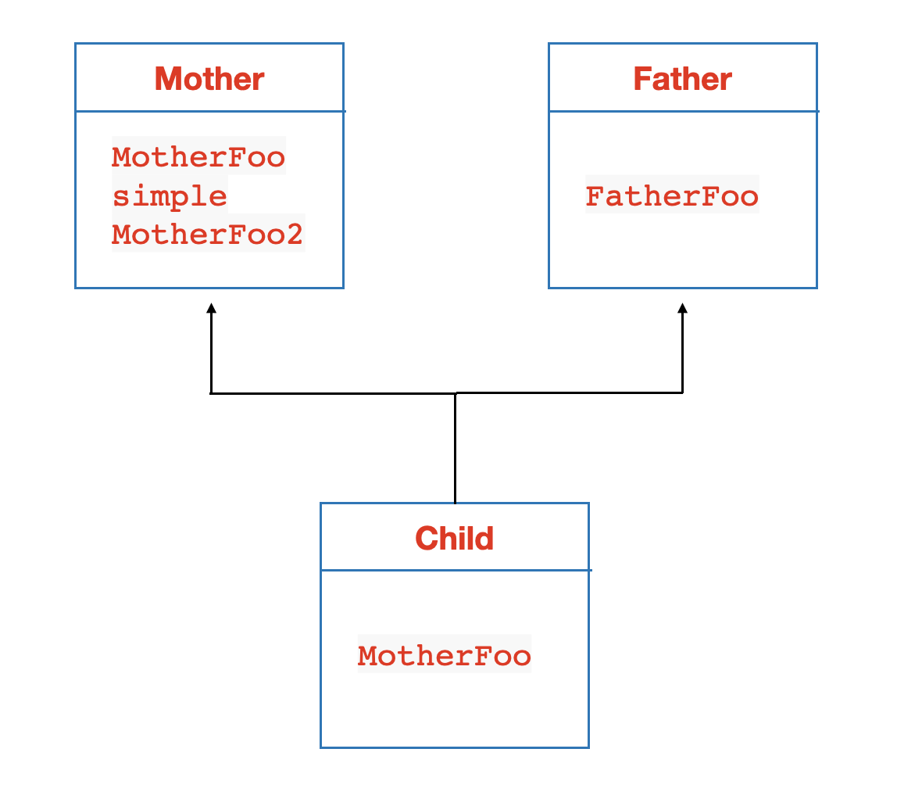

# c++ vtable in llvm ir


本文是对[c++ vtable 深入解析](https://zhuanlan.zhihu.com/p/268324735)的学习，作者深入解析vtable在x86汇编上的实现。

- 本文是从`llvm ir`的角度进行补充，理解llvm对vtable的实现

- vtable的基础知识可以看这篇：[C++中虚函数、虚继承内存模型](https://zhuanlan.zhihu.com/p/41309205)，写得很详细

- llvm ir相关的基础知识可以参考我写的另一篇文章：[llvm ir笔记](https://laity000-learning-notes.readthedocs.io/en/latest/llvm/llvm_ir.html)


## 例子

```c++
class Mother {
public:
 virtual void MotherFoo() { printf("Mother - %p\n", this); }
 void simple() { printf("Simple - %p\n", this); }
 virtual void MotherFoo2() { printf("Mother222 - %p\n", this); }
};

class Father {
public:
 virtual void FatherFoo() {}
};

class Child : public Mother, public Father {
public:
 void MotherFoo() override { printf("Child - %p\n", this); }
};

int main(){
    Mother *b = new Mother();
    b->MotherFoo();
    b->simple();
    Child *c = new Child();
    c->MotherFoo();
    c->MotherFoo2();
    delete b;
    delete c;

    return 0;
}
```



llvm ir: https://godbolt.org/z/3jz34Y8a6


## 概要

你可以学习到：

 - vtable与vptr
 - 多重继承

1.对于每一个多态类型（有虚函数的类），其所有的虚函数的地址都以一个表格的方式存放在一起，称之为`vtable`。在llvm ir上是`指针数组类型的全局变量`，在汇编上是放在`数据段`。

2.每个虚函数的偏移量在基类和子类中均相同，所以虚函数相对于vtable首地址的偏移量在编译时就确定。

3.编译器会给多态对象多创建一个指针`成员变量`（在对象首地址），称为虚(表)指针(vptr)或者虚函数指针(vfptr)。并且编译器会偷偷在对应的构造函数里加上vptr初始化的逻辑：
 - 将vtable地址赋值到vptr（实际上是拿到了vtable里第一个虚函数的地址指针，用gep指令加上偏移，因为前面还有`offset_to_top` `typeinfo`成员）
 - 构造函数里可以拿到对象的this指针，调用哪个决定了多态的实际类型，所以说构造函数不能是虚函数
 - 多重继承的子类由于有多个vptr需要赋值多次，通过`offset_to_top`区分vptr位置

4.vtable成员有哪些：
 - `offset_to_top`：表示的是实际类型起始地址到当前这个形式类型起始地址的**偏移量**。在向上动态转换到实际类型时，让this指针加上这个偏移量即可得到实际类型的地址。
   - 单继承：基类和子类的虚指针共用一个this地址,不用加偏移，offset_to_top是0
   - 多重继承：子类会有多个虚指针，和主基类共用一个地址；非主基类时要加偏移（偏移为内存模型里前个基类的sizeof）
 - `typeinfo`
 - 虚函数地址

5.通过引用或指针调用虚函数时，首先通过虚指针和偏移量计算出虚函数的地址，然后进行调用。多重继承虚函数地址-->Thunk方式实现

6.类的虚表会被这个类的所有对象所共享。但是类的每一个对象有一个属于它自己的虚表指针。

7。多重继承

下面深入分析上述各个点的在`llvm ir`中是如何的实现：
